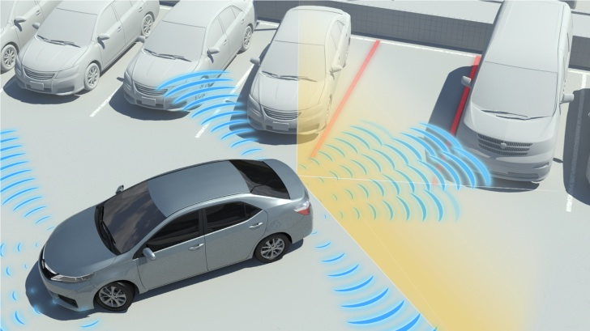
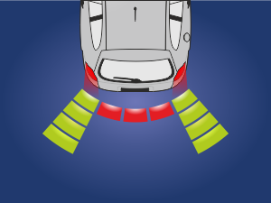
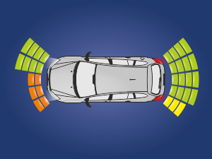
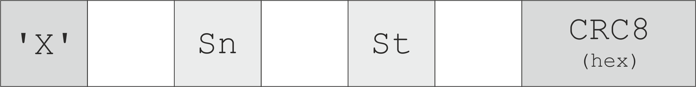
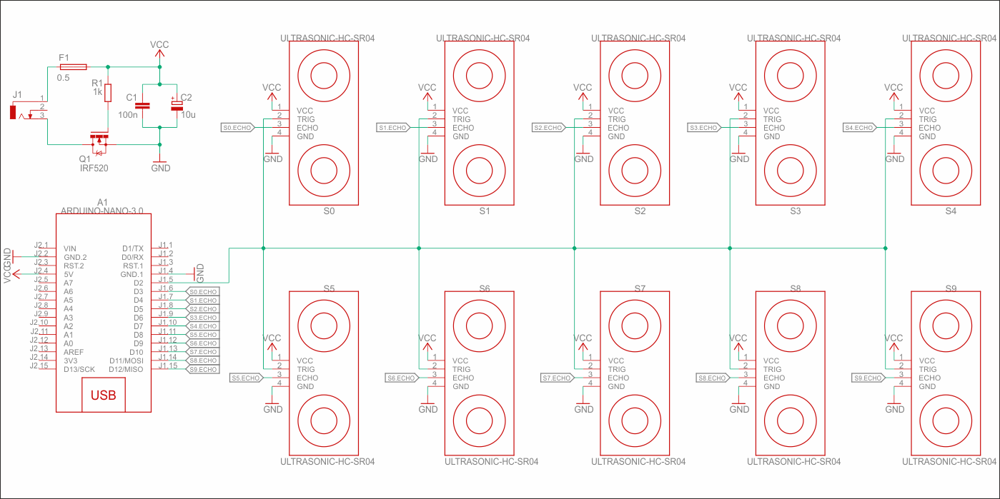

## Platforma czujników – WDS # {#mainpage}

# Opis projektu

Celem projektu jest stworzenie aplikacji ostrzegającej o przeszkodach w otoczeniu robota mobilnego w oparciu o biblioteki Qt języka C++, czujniki ultradźwiękowe HC-SR04 oraz mikrokontroler Arduino Nano. Wizualizacja ma przypominać wizualizację danych z czujników samochodu, wyświetlaną na wewnętrznym, wbudowanym ekranie.

Przykład zastosowania podobnych czujników w praktyce widać na zdjęciu poniżej.

Projekt jest realizowany oczywiście w mniejszej skali, a więc na platformie czujników.  

# Dokumentacja i archiwizacja

Dokumentacja projektu jest tworzona przy pomocy generatora dokumentacji Doxygen i graficznego interfejsu Doxywizard na podstawie plików projektu. Wygenerowana dokumentacja w postaci HTML znajduje się w [repozytorium](https://github.com/Repti993/Ambient-Sensors-Platform/tree/main/doc/html), w którym również znajduje się całe kody źrodłowe aplikacji oraz oprogramowania platformy. Aktualna wersja dokumentacji w formie online powinna również znajdować się na [stronie domowej ~mdolharz na serwerze panamint](http://panamint.ict.pwr.wroc.pl/~mdolharz/wds/).

# Projekt interfejsu

Parkując samochód kierowca trzyma obie ręce na kierownicy i rozgląda się przez okna samochodu badając otoczenie. Informacje wyświetlane na ekranie mają służyć pomocą, muszą więc być automatyczne. 
           
Interfejs składa się z trzech okien, nazywanych widokami. Jest w pełni automatyczny, co oznacza, że odpowiednie widoki są włączane w zależności od czujników, które wykryją przeszkodę. Czujniki są podzielone na przednie i tylne.

Poniżej znajdują się przykładowe wizualizacje.

Istnieje jeszcze okno konfiguracji połączenia transmisji UART, włączane automatycznie i jednorazowo przy starcie aplikacji.

# Protokół komunikacyjny OSOS

**OSOS** – One Sensor One Status.

Platforma czujników komunikuje się z aplikacją za pomocą UART. Gdy dane pochodzące z czujnika wskazują na zmianę statusu, mikrokontroler wysyła odpowiedni komunikat. Dane wysyłane są w postaci ramki.

Komunikacja jest znakowa. Ramka rozpoczyna się od znaku X. Następnie, po spacji, znajduje się numer sensora, którego komunikat dotyczy (Sn). Po kolejnej spacji następuje numer statusu (St). Na koniec, również po spacji, znajduje się suma kontrolna CRC8 w zapisie heksadecymalnym, zajmująca dwa znaki w ramce. 

# Schemat ideowy układu czujników

Utworzony schemat jest jedynie wersją wstępną. Zostanie dopracowany w dalszych etapach projektu.

